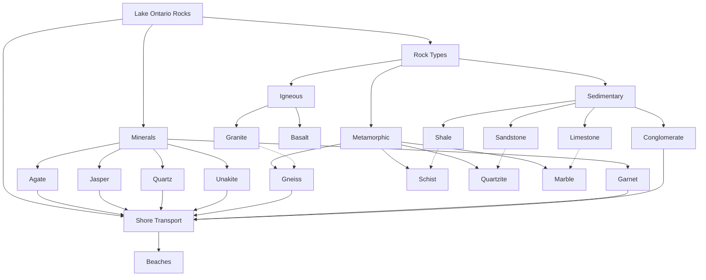

```mermaid
flowchart TD
  A[Lake Ontario Rocks]

  A --> B[Minerals]
  A --> C[Rock Types]
  A --> D[Shore Transport]

  B --> Agate
  B --> Jasper
  B --> Quartz
  B --> Unakite
  B --> Garnet

  C --> Igneous
  C --> Sedimentary
  C --> Metamorphic

  Igneous --> Granite
  Igneous --> Basalt

  Sedimentary --> Sandstone
  Sedimentary --> Limestone
  Sedimentary --> Shale
  Sedimentary --> Conglomerate

  Metamorphic --> Gneiss
  Metamorphic --> Schist
  Metamorphic --> Quartzite
  Metamorphic --> Marble

  Granite -.-> Gneiss
  Sandstone -.-> Quartzite
  Limestone -.-> Marble
  Shale -.-> Schist

  D --> Beaches
  Agate --> D
  Jasper --> D
  Quartz --> D
  Unakite --> D
  Gneiss --> D
  Garnet --> D
  Conglomerate --> D

```

