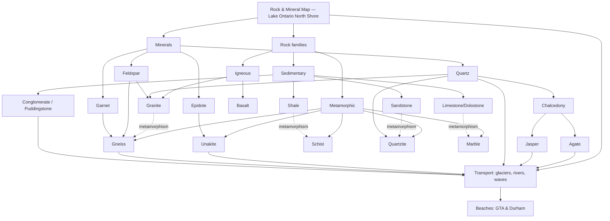

```mermaid
graph TD
    A[Rock & Mineral Map — Lake Ontario North Shore]

    %% Top-level
    A --> B[Minerals]
    A --> C[Rock families]
    A --> G[Transport: glaciers, rivers, waves]
    G --> L[Beaches: GTA & Durham]

    %% Minerals
    B --> Qz[Quartz]
    Qz --> Ch[Chalcedony]
    Ch --> Ag[Agate]
    Ch --> Ja[Jasper]
    B --> Fsp[Feldspar]
    B --> Epi[Epidote]
    B --> Gar[Garnet]

    %% Rock families
    C --> Ig[Igneous]
    C --> Sed[Sedimentary]
    C --> Met[Metamorphic]

    %% Igneous examples
    Ig --> Gran[Granite]
    Ig --> Bas[Basalt]

    %% Sedimentary examples
    Sed --> Sst[Sandstone]
    Sed --> Lst[Limestone/Dolostone]
    Sed --> Sh[Shale]
    Sed --> Cong[Conglomerate / Puddingstone]

    %% Metamorphic examples
    Met --> Gn[Gneiss]
    Met --> Sch[Schist]
    Met --> Qtz[Quartzite]
    Met --> Mar[Marble]
    Met --> Una[Unakite]

    %% Metamorphic pathways
    Gran -. metamorphism .-> Gn
    Sst -. metamorphism .-> Qtz
    Lst -. metamorphism .-> Mar
    Sh  -. metamorphism .-> Sch

    %% Mineral → rock associations
    Qz --> Gran
    Qz --> Qtz
    Fsp --> Gran
    Fsp --> Gn
    Epi --> Una
    Gar --> Gn

    %% Stones that commonly reach the shoreline
    Ag --> G
    Ja --> G
    Qz --> G
    Una --> G
    Gn --> G
    Cong --> G

```

